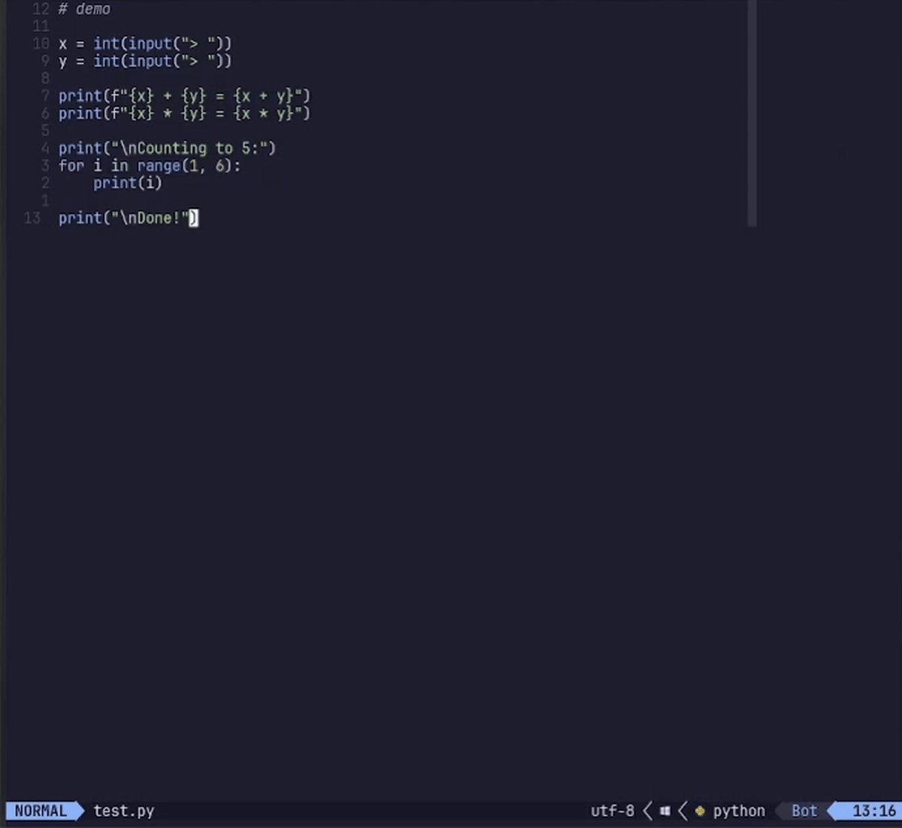

# autorun.nvim

> ⚠️ Early alpha — expect breaking changes

Run your code without leaving Neovim.





## Features

- Runs the current file with `<leader>rr`
- Opens output in a floating window
- Currently supports: **.py(Python)** **.c(C)** **.cpp(C++)**

## Requirements

- Neovim >= 0.9.0

## Installation

With [lazy.nvim](https://github.com/folke/lazy.nvim):

```lua
{
  "sm-joy/autorun.nvim,
}
```

## Configuration

Default values:

```lua
{
  "sm-joy/autorun.nvim",
  opts = {},
}
```

## Usage

Open any supported file and press:

| Keymap | Action |
|:---:|:---:|
| `<leader>rr` | Run the current file |

## Supported Languages

| Language | Runner |
|:---:|:---:|
| Python | `python <file>` |
| C | `c <file>` |
| C++ | `cpp <file>` |
| More coming soon | — |

## Roadmap

- [✔] C/C++ Single File Runner
- [ ] C/C++ Makefile Support
- [ ] Rust runner
- [ ] Go runner
- [ ] User commands
- [ ] Configurable run command per filetype
- [ ] `:help autorun` vimdoc

## License

MIT © [sm-joy](https://github.com/sm-joy)
