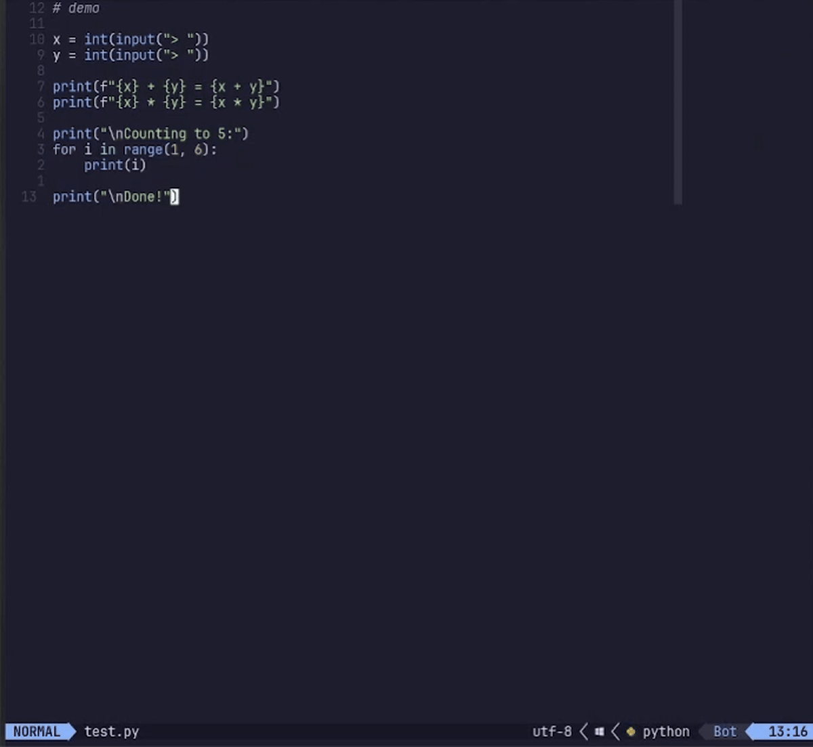

# autorun.nvim

> ⚠️ Early alpha — expect breaking changes

Run your code without leaving Neovim.





## Features

- Runs the current file with `<leader>rr`
- Opens output in a floating/split window
- Currently supports: **.py(Python)** **.c(C)** **.cpp(C++)**

## Requirements

- Neovim >= 0.10.0

## Installation

With [lazy.nvim](https://github.com/folke/lazy.nvim):

```lua
{
  "sm-joy/autorun.nvim,
}
```


## Configuration Reference

| Key | Type | Default | Available Options |
|---|---|---|---|
| `prefered_compilers.c` | string | `"gcc"` | `"gcc"`, `"clang"`, `"tcc"`, `"cc"` |
| `prefered_compilers.cpp` | string | `"g++"` | `"g++"`, `"clang++"`, `"c++"` |
| `window.type` | string | `"float"` | `"float"`, `"split"` |
| `split_opts.style` | string | `"vertical"` | `"vertical"`, `"horizontal"` |
| `split_opts.direction` | string | `"right"` | `"right"`, `"left"`, `"above"`, `"below"` |
| `split_opts.size_ratio` | number | `0.2` | any float `0.0–1.0` |
| `float_opts.width_ratio` | number | `0.8` | any float `0.0–1.0` |
| `float_opts.height_ratio` | number | `0.8` | any float `0.0–1.0` |
| `float_opts.border` | string | `"rounded"` | `"rounded"`, `"single"`, `"double"`, `"none"` |

## Default Configuration

```lua
{
  "sm-joy/autorun.nvim",
  opts = {
    prefered_compilers = {
      c = "gcc",
      cpp = "g++",
    },
    window = {
      type = "float",
      split_opts = {
        style = "vertical",
        direction = "right",
        size_ratio = 0.2,
      },
      float_opts = {
        width_ratio = 0.8,
        height_ratio = 0.8,
        border = "rounded",
      },
    },
  },
}
```

## Usage

Open any supported file and press:

|     Keymap   |        Action        |
|:------------:|:--------------------:|
| `<leader>rr` | Run the current file |

## Supported Languages

- **Python**
- **C**
- **C++** 
- **More coming soon**

## Roadmap

- [✔] C/C++ Single File Runner
- [ ] C/C++ Makefile Support
- [ ] Rust runner
- [ ] Go runner
- [ ] User commands
- [ ] `:help autorun` vimdoc

## License

MIT © [sm-joy](https://github.com/sm-joy)
